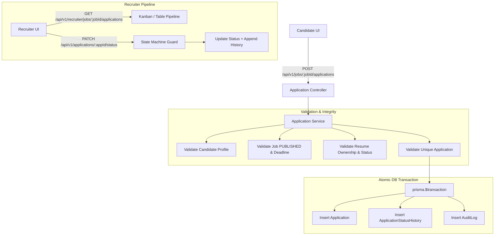

# ADR 016: Job Applications & Application Lifecycle Architecture

## Status
Accepted (Phase 12)

## Context
Candidates discovering jobs through the public search marketplace (Phase 11) need a secure, reliable mechanism to apply using their existing parsed resumes and optional cover letters. Recruiters (Phase 10) require structured multi-tenant pipelines to track candidate progression across recruitment stages with auditable history logs and transition guards.

## Decision Drivers
1. **Lifecycle Determinism**: Strictly enforce application state machine transitions (`APPLIED` → `SCREENING` → `SHORTLISTED` → `INTERVIEW` → `OFFERED` → `HIRED` / `REJECTED` / `WITHDRAWN`).
2. **Duplicate Prevention**: Enforce database uniqueness on candidate and job (`@@unique([candidateId, jobId])`).
3. **Multi-Tenant Ownership & IDOR Protection**: Candidates can only apply with their own resumes and view their own applications; recruiters can only view/transition applications for jobs they own.
4. **Transactional Audit Logging**: Atomically mutate application records while inserting `ApplicationStatusHistory` and `AuditLog` rows in a single `prisma.$transaction`.
5. **Separation of Concerns**: Keep matching, ranking algorithms, and Kafka consumers decoupled for future phases (Phase 13+).

## Architecture & Data Flow



## State Transition Rules

```text
APPLIED      ──> SCREENING, SHORTLISTED, INTERVIEW, OFFERED, REJECTED, WITHDRAWN
SCREENING    ──> SHORTLISTED, INTERVIEW, OFFERED, REJECTED, WITHDRAWN
SHORTLISTED  ──> INTERVIEW, OFFERED, REJECTED, WITHDRAWN
INTERVIEW    ──> OFFERED, REJECTED, WITHDRAWN
OFFERED      ──> HIRED, REJECTED
HIRED        ──> [TERMINAL STATE]
REJECTED     ──> [TERMINAL STATE]
WITHDRAWN    ──> [TERMINAL STATE]
```

## Consequences

### Positive
- **Integrity**: Candidates cannot apply twice or attach other candidates' resumes.
- **Explainability**: Every state change preserves chronological records of who modified the status, when, and with what internal feedback note.
- **Tenant Isolation**: Cross-tenant recruiter access and cross-candidate application access strictly return 403 Forbidden.

### Neutral / Trade-offs
- AI match scores and candidate ranking columns are prepared for Phase 13 without blocking the core application workflow.
